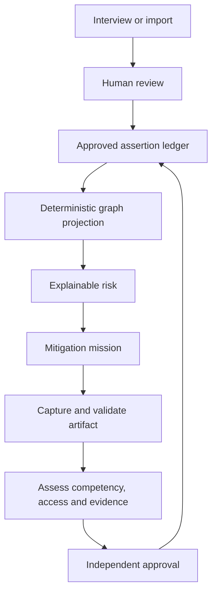

# Company Brain OS

> Operational continuity intelligence: detect concentrated knowledge risk, transfer capability, and prove the dependency went down.

[](https://github.com/Jairogelpi/company-brain-os/actions/workflows/ci.yml)
[](https://nextjs.org/)
[](https://react.dev/)
[](https://www.typescriptlang.org/)
[](https://www.postgresql.org/)
[](https://www.docker.com/)

Company Brain OS maps critical knowledge, processes, systems and external relationships; derives explainable continuity risks; and turns each exposure into an evidence-backed mitigation mission. It is designed for organizations where operational knowledge is concentrated in a small number of people.

**Start here:** [Product contract](docs/product/COMPANY_BRAIN_OS_V4.md) · [Canonical demo](docs/demo/PEDRO_LAURA.md) · [Architecture](docs/architecture/CANONICAL_LEDGER.md) · [Security](docs/security/SAAS_SECURITY.md) · [Run locally](#run-locally) · [Documentation map](docs/README.md)

## Why it is different

Company Brain OS does not treat a document as proof that a dependency has been removed. A person-dependency risk only closes when the system can trace approved facts, required competency, access, evidence and independent review.

| Layer | Guarantee |
| --- | --- |
| Canonical truth | Approved assertion/evidence ledger; AI cannot approve facts |
| Read model | Deterministic, rebuildable graph with provenance |
| Risk engine | Versioned and explainable; exact facts and rules are retained |
| Mitigation | Mission workflow with artifact, competency, access and evidence checks |
| Transfer proof | Independent approval; self-review is rejected |
| Multi-tenancy | Organization-scoped RBAC, PostgreSQL RLS and tenant foreign keys |
| Production | Least-privilege DB role, separate worker, ClamAV, Docker and GHCR |

## Product loop



## Canonical executable proof: Pedro → Laura

The acceptance journey proves four product invariants:

1. Pedro starts as the only expert and the risk cites approved canonical assertions.
2. Approving a procedure removes the documentation gap, but does **not** falsely remove the person dependency.
3. Laura only becomes a valid backup after competency ≥3, required access, evidence and independent approval exist.
4. The mitigation closes, risk is recalculated, and repeated graph rebuilds produce the same hash.

```bash
cd web
npm ci
npm run test:e2e
```

Read the scenario and expected evidence in [docs/demo/PEDRO_LAURA.md](docs/demo/PEDRO_LAURA.md).

## What is implemented

- Adaptive Spanish/English continuity capture with deterministic fallback when AI is unavailable.
- Human Review Inbox: AI and imports propose; they never approve canonical truth.
- Governed assertion/evidence ledger; approved claims are versioned instead of silently overwritten.
- Deterministic graph projection with provenance on every node and relationship.
- Explainable, versioned risks with exact input facts and assertion references.
- Mitigation missions with contribution, artifact review and verified transfer.
- Non-destructive simulator, succession playbooks, knowledge assistant and executive metrics.
- Organization-scoped RBAC, PostgreSQL RLS, composite tenant foreign keys and non-owner production DB role.
- Expiring workspace invitations with hashed one-time tokens and durable delivery.
- Canonical User→Person mapping with explicit protections against self-assessment and self-review.
- Tenant-partitioned uploads, magic-byte validation, SHA-256 hashes, ClamAV scanning and distributed rate limiting.
- Separate production worker for transcription, proposal ingestion and durable notification delivery.

The accepted product contract is [Company Brain OS v4](docs/product/COMPANY_BRAIN_OS_V4.md).

## Architecture

| Concern | Implementation |
| --- | --- |
| Application | Next.js 16.3.2, React 19.2, strict TypeScript |
| Canonical truth | PostgreSQL assertion/evidence ledger |
| Read model | Deterministic nodes/edges projection |
| Isolation | Organization context, RLS, tenant FKs, RBAC/ABAC |
| Storage | Disk or S3-compatible object storage with tenant partitions |
| Upload security | Allow-list, signatures, ClamAV, hashes and safe disposition |
| Async work | Separate worker with durable PostgreSQL jobs/outbox and bounded retries |
| Delivery | Docker Compose, GitHub Actions and GHCR |

The graph is disposable. Rejected, expired, superseded and archived assertions cannot appear in it. See [Canonical Ledger Architecture](docs/architecture/CANONICAL_LEDGER.md).

## Run locally

Requirements: Node.js 22+, npm 10+, Docker, and PostgreSQL 16 with `pgvector`.

Start PostgreSQL with pgvector:

```bash
docker run --name company-brain-postgres \
  -e POSTGRES_USER=postgres \
  -e POSTGRES_PASSWORD=postgres \
  -e POSTGRES_DB=company_brain_os \
  -p 5432:5432 \
  -d pgvector/pgvector:pg16
```

Then run the app:

```bash
cd web
npm ci
cp .env.example .env.local
npm run db:migrate
npm run db:seed       # local/demo only; never automatic in production
npm run dev
```

Open `http://localhost:3000`.

## Reproduce the repository gate locally

With PostgreSQL running at the default development URL, one command executes the repository-controlled verification sequence:

```bash
cd web
npm run verify:all
```

That command runs migrations, an explicit demo/test seed, the full test suite, Pedro/Laura E2E, critical coverage, PostgreSQL tenant-isolation tests, TypeScript, the production build and the production dependency vulnerability gate. It mirrors the permanent GitHub CI gates; `npm ci` remains a separate clean-install prerequisite.

For individual gates:

```bash
npm test -- --run
npm run test:e2e
npm run test:critical
npm run test:integration
npm run typecheck
npm run build
npm audit --omit=dev --audit-level=high
```

The permanent CI definition is the source of truth: [.github/workflows/ci.yml](.github/workflows/ci.yml).

## Production

Production Compose starts PostgreSQL, migrations, a least-privilege application role, ClamAV, the Next.js application and a separate worker. It does **not** create demo tenants or users.

```bash
docker compose -f docker-compose.prod.yml up -d --build
```

Follow [DEPLOY.md](DEPLOY.md) for required secrets, TLS, backup/restore, object storage and verification.

## Evidence status

This repository deliberately separates engineering proof from external outcome claims.

| Status | Evidence |
| --- | --- |
| Implemented | Ledger, deterministic graph, risk engine, missions, transfer verification, multi-tenancy, production stack |
| Repository-verified | Automated tests, canonical E2E, critical coverage, PostgreSQL isolation, typecheck, production build, dependency audit |
| Requires external validation | Paid pilot, customer baseline/outcomes, timed restore drill, counsel-approved agreements, independent pentest/certification |

Repository tests are evidence that the implementation behaves as specified. They are **not** evidence that a customer achieved a commercial outcome. See [Release Scorecard](docs/RELEASE_SCORECARD.md) and the open external-validation gate in the issue tracker.

## Documentation

The complete reading map is in [docs/README.md](docs/README.md). Key paths:

- [Product contract](docs/product/COMPANY_BRAIN_OS_V4.md)
- [Canonical ledger architecture](docs/architecture/CANONICAL_LEDGER.md)
- [Pedro → Laura executable demonstration](docs/demo/PEDRO_LAURA.md)
- [SaaS security model](docs/security/SAAS_SECURITY.md)
- [Production runbook](docs/operations/PRODUCTION_RUNBOOK.md)
- [Release scorecard](docs/RELEASE_SCORECARD.md)
- [Portfolio case study](docs/portfolio/CASE_STUDY.md)
- [Pilot offer and measurement plan](docs/commercial/PILOT_OFFER.md)
- [One-page offer and sales playbook](docs/commercial/ONE_PAGE.md)
- [Contributing](CONTRIBUTING.md)
- [Changelog](CHANGELOG.md)

## Responsible product boundary

Company Brain OS measures operational dependency, not employee productivity, loyalty or performance. AI may extract, propose, explain and draft; it cannot approve facts, close risks, change permissions or make employment decisions.

## License

Proprietary software. All rights reserved unless otherwise stated in a written agreement.
