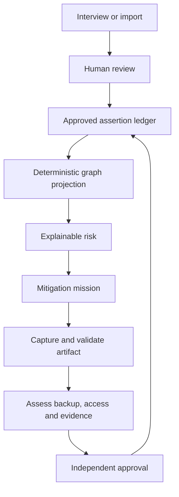

# Company Brain OS

> Operational continuity intelligence: find what the company cannot afford to lose, transfer it, and prove the risk went down.

[](https://github.com/Jairogelpi/company-brain-os/actions/workflows/ci.yml)
[](https://nextjs.org/)
[](https://www.typescriptlang.org/)
[](https://www.postgresql.org/)

Company Brain OS maps critical knowledge, processes, systems and external relationships; derives explainable continuity risks; and turns each exposure into an evidence-backed mitigation mission. It is designed for companies with 20–500 employees where operational knowledge is concentrated in a few people.

## The product loop



A document alone never closes a person-dependency risk. A backup counts only after competency, required access, evidence and an independent reviewer are recorded.

## What is implemented

- Adaptive Spanish/English continuity capture with deterministic fallback when AI is unavailable.
- Human review Inbox: AI and imports propose; they never approve or write canonical truth.
- Governed assertion/evidence ledger as the source of truth; claim content is never silently overwritten.
- Rebuildable graph projection with provenance on every node and relationship.
- Versioned deterministic risks with exact input facts and assertion references.
- Mission workflow for contribution, artifact review and verified transfer.
- Non-destructive simulator, succession playbooks, knowledge assistant and executive metrics.
- Organization-scoped RBAC, PostgreSQL RLS (including HR profiles), composite tenant foreign keys and a non-owner production database role.
- Owner-managed, expiring workspace invitations with hashed one-time tokens and durable email delivery.
- Owner-managed 1:1 User→Person identity mapping; verified transfers compare canonical IDs and reject self-assessment/review.
- Tenant-partitioned uploads, magic-byte validation, SHA-256 hashes, ClamAV scanning and distributed rate limiting.
- Separate production worker for transcription, proposal ingestion and durable notification delivery.

The accepted product contract is [Company Brain OS v4](docs/product/COMPANY_BRAIN_OS_V4.md).

## Canonical proof: Pedro → Laura

The executable acceptance journey proves that:

1. Pedro is the only expert and the risk cites approved assertions.
2. Approving a procedure removes the documentation gap, not the dependency risk.
3. Laura only becomes a backup after competency ≥3, access, evidence and independent approval.
4. The mission then closes, the risk is recalculated and two graph rebuilds have the same hash.

```bash
cd web
npm ci
npm run test:e2e
```

See [the canonical demonstration](docs/demo/PEDRO_LAURA.md).

## Architecture

| Concern | Implementation |
| --- | --- |
| Application | Next.js 15, React 19, strict TypeScript |
| Canonical truth | PostgreSQL assertion and evidence ledger |
| Read model | Deterministic nodes/edges projection |
| Isolation | Organization context, RLS, tenant FKs, RBAC/ABAC |
| Storage | Disk or S3-compatible object storage, tenant partitions |
| Upload security | Allow-list, signatures, ClamAV, hashes, safe disposition |
| Async work | Separate worker with durable PostgreSQL jobs/outbox and bounded retries |
| Delivery | Docker Compose, GitHub Actions, GHCR |

The graph is a disposable read model. Rejected, expired, superseded and archived assertions cannot appear in it. More detail: [canonical ledger architecture](docs/architecture/CANONICAL_LEDGER.md).

## Local development

Requirements: Node.js 22+, npm 10+, and PostgreSQL 16 with `pgvector`.

```bash
cd web
npm ci
cp .env.example .env.local
npm run db:migrate
npm run db:seed       # local/demo only; never run automatically in production
npm run dev
```

Open [http://localhost:3000](http://localhost:3000).

## Production

Production Compose starts PostgreSQL, migrations, a least-privilege app role, ClamAV, the Next.js app and a separate worker. It does **not** create demo tenants or users.

```bash
docker compose -f docker-compose.prod.yml up -d --build
```

Follow [DEPLOY.md](DEPLOY.md) for required secrets, TLS, backup/restore, object storage and verification.

## Quality gates

```bash
cd web
npm run typecheck
npm test -- --run
npm run test:e2e
npm run test:critical
npm run build
```

CI additionally migrates a real PostgreSQL service and tests cross-tenant read/write denial with a non-superuser role.

## Product and commercial material

- [Portfolio case study](docs/portfolio/CASE_STUDY.md)
- [Pilot offer and measurement plan](docs/commercial/PILOT_OFFER.md)
- [One-page offer and sales playbook](docs/commercial/ONE_PAGE.md)
- [Pilot release scorecard](docs/RELEASE_SCORECARD.md)
- [SaaS security model](docs/security/SAAS_SECURITY.md)
- [Production runbook](docs/operations/PRODUCTION_RUNBOOK.md)
- [Contributing](CONTRIBUTING.md)

## Responsible product boundary

Company Brain OS measures operational dependency, not employee productivity, loyalty or performance. AI may extract, propose, explain and draft; it cannot approve facts, close risks, change permissions or make employment decisions.

## License

Proprietary software. All rights reserved unless otherwise stated in a written agreement.
