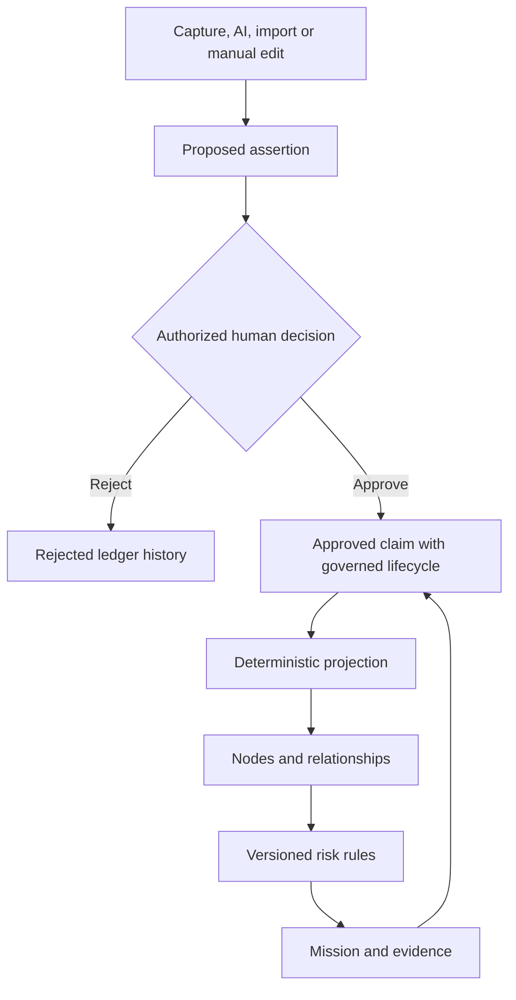

# Canonical ledger architecture

## Decision

The assertion/evidence ledger is the only source of organizational truth. The graph is a materialized read model that can be deleted and deterministically rebuilt.

## Assertion contract

An assertion records organization, subject, predicate, object or scalar value, source, proposer, approver, status, validity window, recording time, supersession, confidence class, review date and metadata. Approved assertions require an explicit approver. Invalid validity windows are rejected.

Canonical writes insert the complete assertion batch, a normalized evidence source/item and one assertion-evidence link per claim in a single tenant transaction. Partial multi-claim entities cannot survive a failed write.

Node properties are scalar claims such as `ENTITY_TYPE`, `ENTITY_NAME`, `CRITICALITY`, `DOCUMENTED` and `CONFIDENCE`. Relationships use the canonical edge predicate. Projection rows contain the assertion IDs that produced them.

## Projection rules

- Only approved assertions that are valid at projection time participate.
- The latest approved scalar wins without mutating older history.
- Both entity type and name are required; Knowledge also requires type, documentation state, validation state and confidence.
- Dangling or invalid relationship endpoints are rejected from projection and reported.
- Rebuilding deletes every existing projection edge and node, then recreates nodes before relationships.
- Hashing stable projected nodes and edges provides a deterministic rebuild check.

## Write paths

Human graph edits are translated to approved assertions with the authenticated actor as proposer and approver. AI and imports are stored in the Inbox and require explicit decisions. Deletion archives canonical assertions; it never erases ledger history. The old mutable graph service remains a projection adapter for isolated domain tests, but server write paths use `canonical-graph-writer.ts`.

## Risk derivation

Risks store rule ID, rule version, trigger, input facts, affected entities and evidence references. Canonical projections yield `assertion:<id>` references. Documentation can resolve an undocumented-knowledge risk, but cannot resolve a bus-factor-one risk.

## Migration

Migration `0018_canonical_ledger_backfill.sql` converts legacy nodes and edges to unverified, review-due assertions and links them to migration evidence items. This preserves upgrade continuity while making the legacy origin explicit.
